# Last-Mile Delivery Tracker

A full-stack delivery management platform where customers place orders with auto-calculated shipping charges, delivery agents update order status in real time, and admins manage zones, rate cards, and agent assignments. Email notifications are sent to customers on every status change.

---
## 🚀 Live Demo
- 🌐 **Live Application:** https://last-mile-delivery-tracker-1-035t.onrender.com
- [](https://last-mile-delivery-tracker-1-035t.onrender.com)
- ⚙️ **Backend API:** https://last-mile-delivery-tracker-hl9j.onrender.com
---

## Table of Contents

- [What It Does](#what-it-does)
- [How It Works](#how-it-works)
- [Tech Stack](#tech-stack)
- [Project Structure](#project-structure)
- [Database Schema](#database-schema)
- [Rate Calculation Engine](#rate-calculation-engine)
- [Auto-Assignment Logic](#auto-assignment-logic)
- [Order Status Lifecycle](#order-status-lifecycle)
- [Failed Delivery Flow](#failed-delivery-flow)
- [API Reference](#api-reference)
- [Setup Guide](#setup-guide)
- [Environment Variables](#environment-variables)
- [Seed Data](#seed-data)

---

## What It Does

| Role | Capabilities |
|------|-------------|
| **Customer** | Register, log in, place orders, preview charges before confirming, view live tracking timeline, reschedule failed deliveries |
| **Delivery Agent** | View assigned orders, update status step-by-step (Picked Up → In Transit → Out for Delivery → Delivered / Failed) |
| **Admin** | Manage zones and areas, configure rate cards and COD surcharges, create orders on behalf of customers, manually or auto-assign agents, filter all orders by status/zone/agent, override any order status |

---

## How It Works

### 1. Order Creation
A customer (or admin on their behalf) submits:
- Pickup and drop addresses with pincodes
- Package dimensions (L × B × H in cm)
- Actual weight (kg)
- Order type: `B2B` or `B2C`
- Payment type: `Prepaid` or `COD`

Before confirming, the customer sees a full **charge breakdown** — zone pair, billed weight, rate/kg, COD surcharge, and total.

### 2. Charge Calculation
The rate engine runs automatically:
1. Looks up the **pickup pincode** → finds its Zone
2. Looks up the **drop pincode** → finds its Zone
3. Computes **volumetric weight** = `(L × B × H) / 5000`
4. Uses **billed weight** = `max(actual_weight, volumetric_weight)`
5. Looks up the **Rate Card** for `(pickup_zone, drop_zone, order_type)`
6. Applies **COD surcharge** if payment type is COD (percentage is per order type, admin-configurable)
7. Returns `base_charge + cod_surcharge = total_charge`

All rates are stored in the database — nothing is hardcoded.

### 3. Agent Assignment
After an order is confirmed:
- Admin can **manually assign** a specific agent
- Admin can trigger **auto-assignment**, which:
  1. Prefers available agents in the **pickup zone**
  2. Falls back to any available agent across all zones
  3. Marks the agent as `isAvailable: false` once assigned

### 4. Delivery & Tracking
The assigned agent updates status through the lifecycle. Every status change:
- Creates an immutable `TrackingEvent` (status, actor, timestamp, notes)
- Sends an email notification to the customer
- On terminal status (`delivered` or `failed`), marks the agent as available again

### 5. Failed Delivery
If marked `failed`:
- Customer is notified by email
- Customer can reschedule by picking a new date
- System auto-assigns a new agent for the rescheduled attempt

---
## 📸 Screenshots

### Login/Register Page

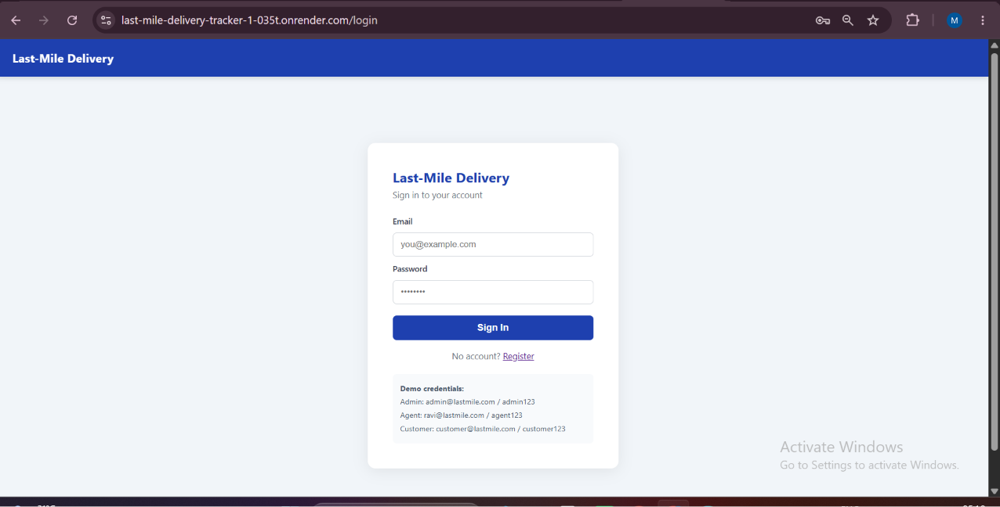
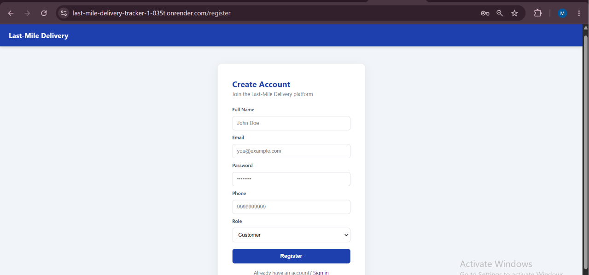

### Customer Dashboard

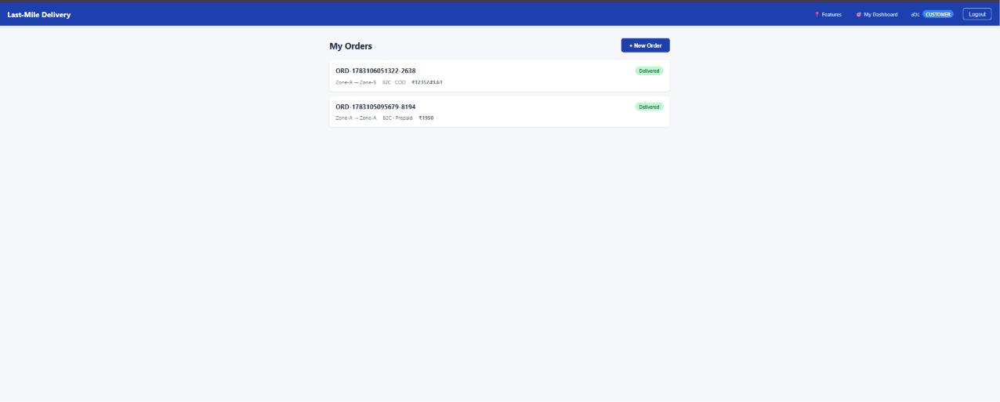
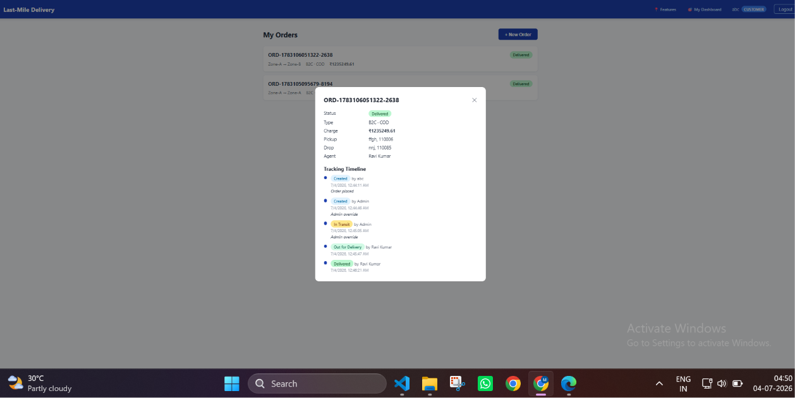
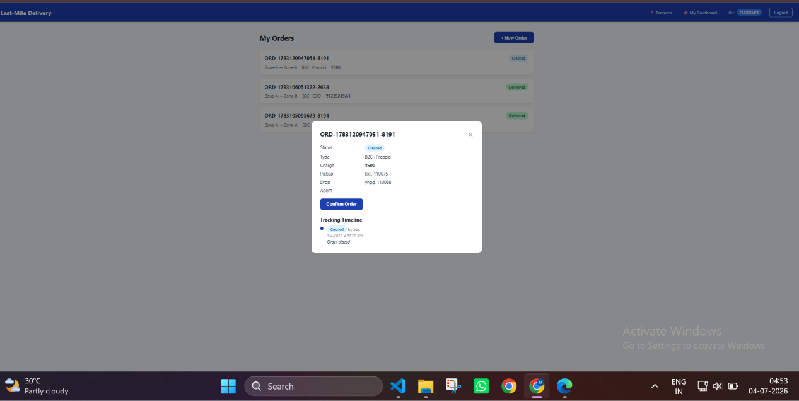
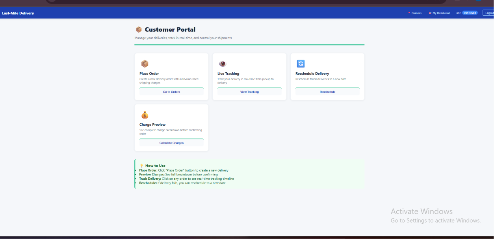

### Admin Dashboard

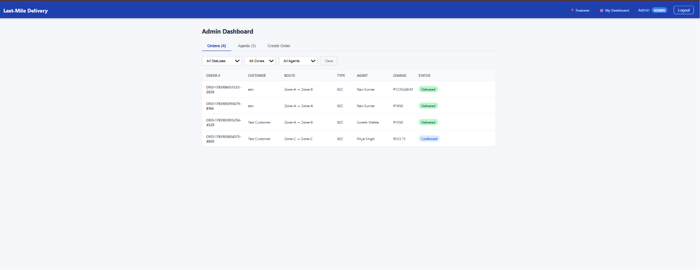
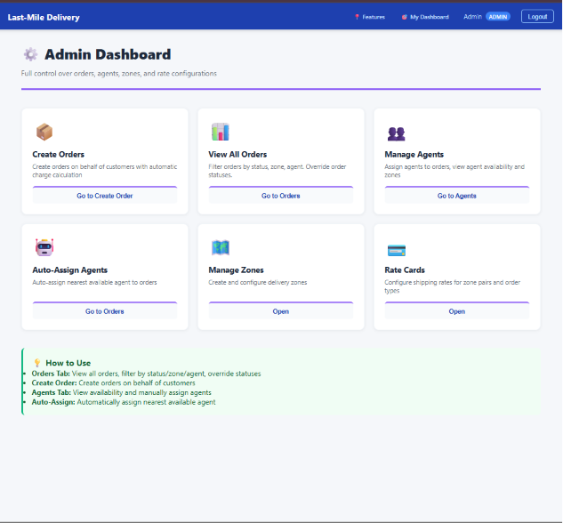
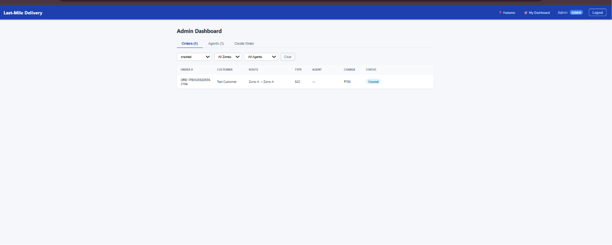
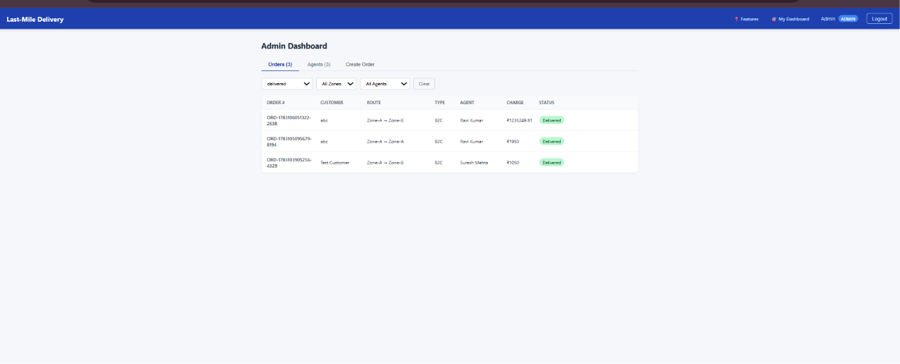
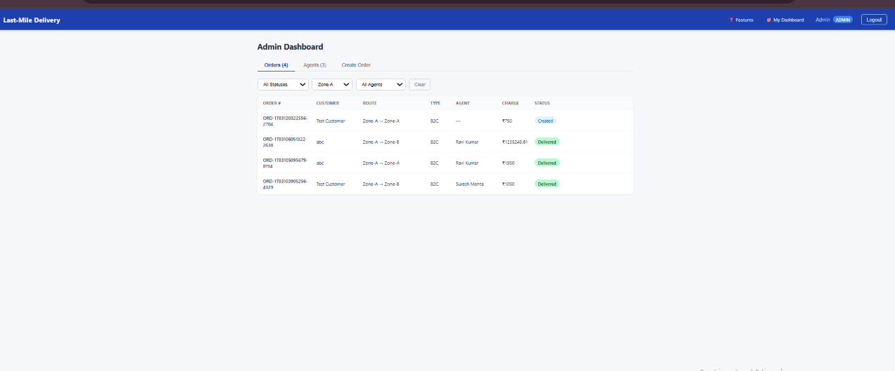
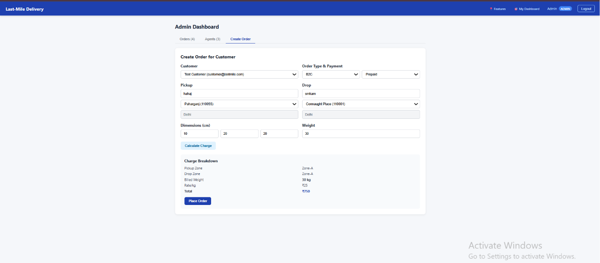
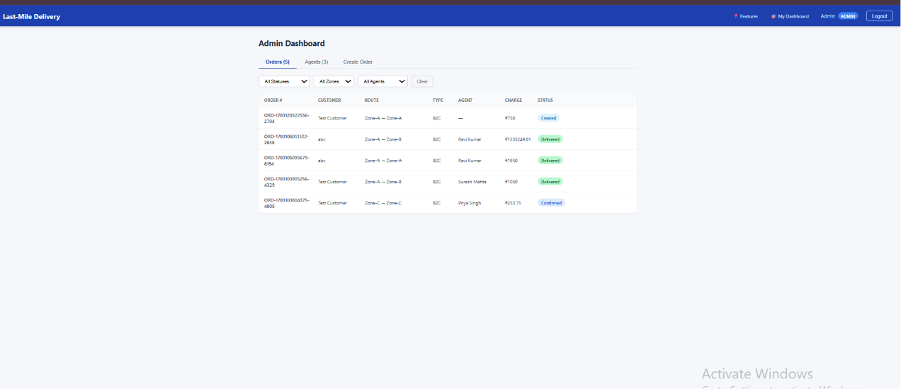
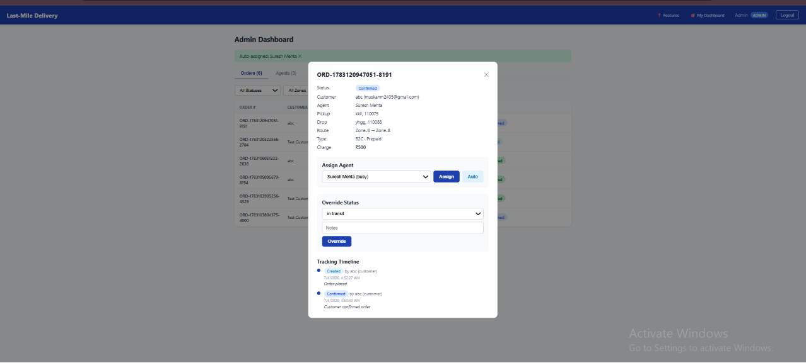
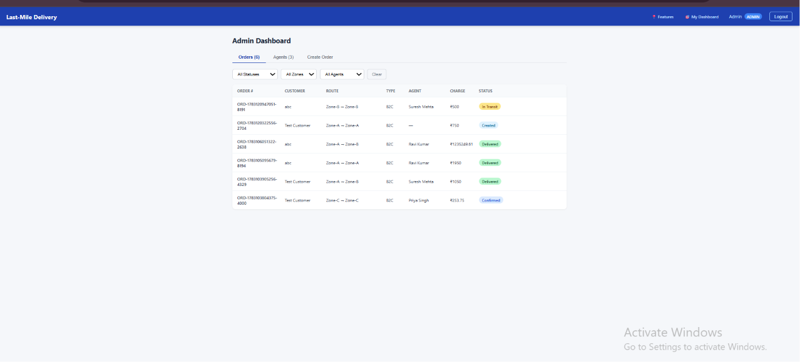


### Delivery Agent Dashboard
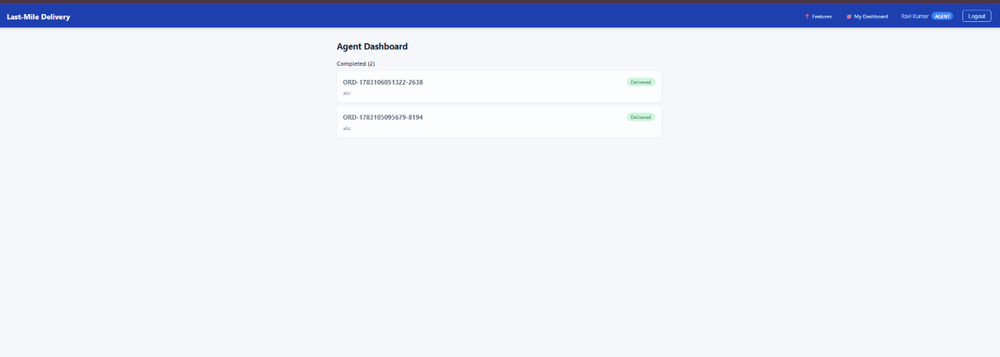
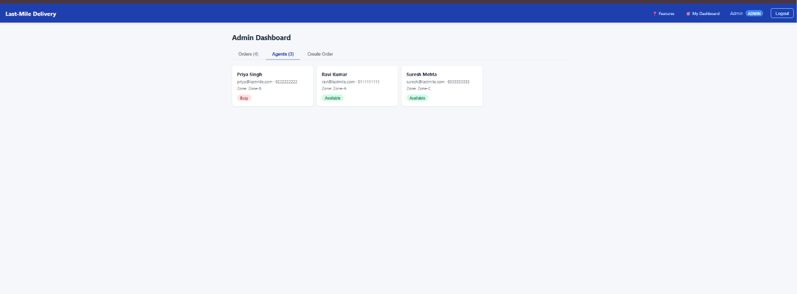
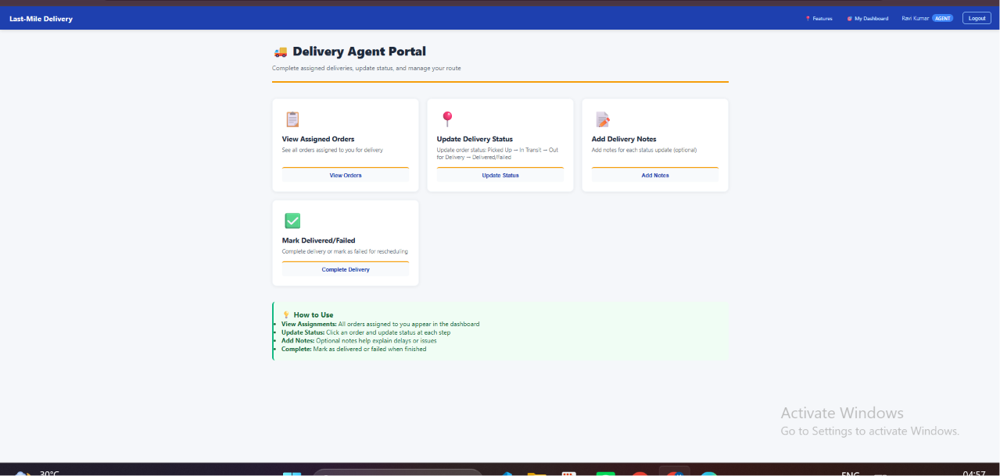
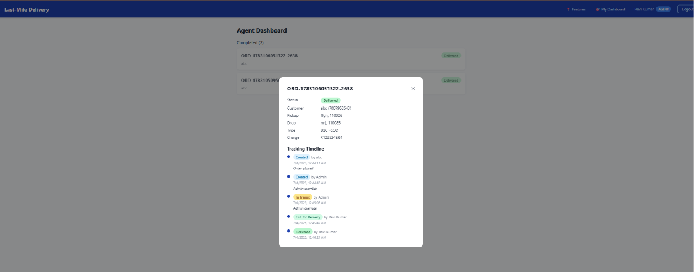


### Mail notifications
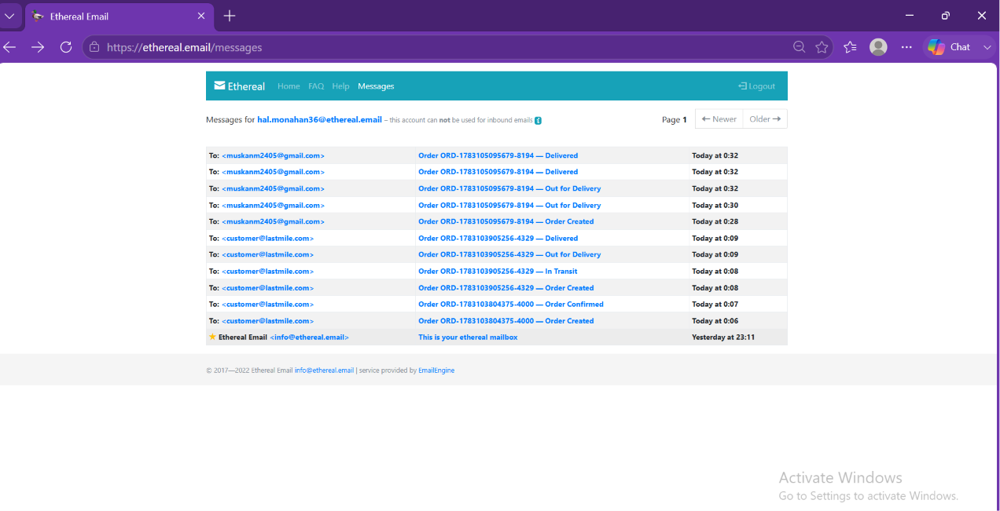
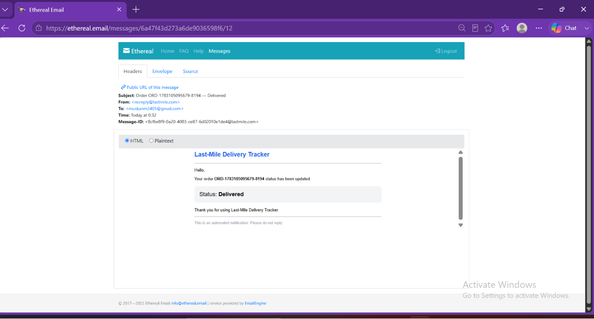


---

## Tech Stack

| Layer | Technology |
|-------|-----------|
| Frontend | React 18, React Router v6, Vite, Axios |
| Backend | Node.js, Express.js |
| Database | MongoDB (via Mongoose) |
| Auth | JWT (JSON Web Tokens), bcryptjs |
| Email | Nodemailer (SMTP — Ethereal / Gmail / any SMTP) |
| Dev tools | Nodemon |

---

## Project Structure

```
last-mile-delivery/
├── backend/
│   ├── middleware/
│   │   ├── auth.js           # JWT verification, attaches req.user
│   │   └── role.js           # Role-based access control factory
│   ├── models/
│   │   ├── User.js           # customer / delivery_agent / admin
│   │   ├── Order.js          # Core order document
│   │   ├── TrackingEvent.js  # Immutable status change log
│   │   ├── Zone.js           # Delivery zones (e.g. Zone-A, Zone-B)
│   │   ├── Area.js           # Pincode → Zone mapping
│   │   ├── RateCard.js       # Per-zone-pair, per-order-type rate (₹/kg)
│   │   └── CODSurcharge.js   # COD surcharge % per order type
│   ├── routes/
│   │   ├── auth.js           # /api/auth — register, login, me
│   │   ├── orders.js         # /api/orders — full order lifecycle + admin routes
│   │   ├── zones.js          # /api/zones — CRUD (admin)
│   │   ├── areas.js          # /api/areas — CRUD (admin)
│   │   ├── rateCards.js      # /api/rate-cards — CRUD (admin)
│   │   ├── codSurcharges.js  # /api/cod-surcharges — CRUD (admin)
│   │   └── agents.js         # /api/agents — list agents (admin)
│   ├── services/
│   │   ├── rateCalculator.js # Zone detection + volumetric weight + rate lookup
│   │   ├── agentAssignment.js# Auto-assign nearest/available agent
│   │   └── notification.js   # Nodemailer email on status change
│   ├── server.js             # App entry point + DB seed on first run
│   ├── .env                  # Local secrets (not committed)
│   └── .env.example          # Template for environment variables
└── frontend/
    └── src/
        ├── components/
        │   ├── Navbar.jsx          # Role-aware navigation bar
        │   ├── ProtectedRoute.jsx  # Auth + role guard for routes
        │   └── OrderStatusBadge.jsx# Coloured status pill component
        ├── context/
        │   └── AuthContext.jsx     # Global auth state (user, token, login/logout)
        ├── pages/
        │   ├── Login.jsx           # Login form
        │   ├── Register.jsx        # Registration (customer / delivery_agent)
        │   ├── CustomerDashboard.jsx  # Place orders, track, reschedule
        │   ├── AgentDashboard.jsx     # View assigned orders, update status
        │   └── AdminDashboard.jsx     # Orders table, agent mgmt, create orders
        ├── services/
        │   └── api.js              # Axios instance with JWT interceptor
        ├── App.jsx                 # Route definitions
        └── main.jsx                # React root mount
```

---

## Database Schema

### User
```
name, email, password (bcrypt), role (customer|delivery_agent|admin),
phone, isAvailable (agents), currentZone (ObjectId → Zone), location {lat, lng}
```

### Zone
```
name (unique), description
```

### Area
```
name, pincode (unique), zone (ObjectId → Zone)
```

### RateCard
```
zone_from (ObjectId → Zone), zone_to (ObjectId → Zone),
order_type (B2B|B2C), rate_per_kg (Number), is_intra (Boolean)
```

### CODSurcharge
```
order_type (B2B|B2C), percentage (Number)
```

### Order
```
order_number (auto-generated: ORD-{timestamp}-{random}),
customer, created_by, pickup_address {street, city, pincode},
drop_address {street, city, pincode}, pickup_zone, drop_zone,
dimensions {length, breadth, height}, actual_weight, volumetric_weight,
billed_weight, order_type, payment_type, charge, status, agent,
scheduled_date, timestamps
```

### TrackingEvent
```
order (ObjectId → Order), status, actor (ObjectId → User),
timestamp (auto), notes
```

---

## Rate Calculation Engine

```
volumetric_weight = (length × breadth × height) / 5000

billed_weight = max(actual_weight, volumetric_weight)

rate = RateCard[pickup_zone][drop_zone][order_type].rate_per_kg

base_charge = billed_weight × rate

cod_surcharge = (payment_type === 'COD')
  ? base_charge × (CODSurcharge[order_type].percentage / 100)
  : 0

total_charge = base_charge + cod_surcharge
```

All values in the rate matrix and COD surcharge table are stored in MongoDB and fully configurable by the admin — no hardcoded prices.

**Seeded rate matrix (₹/kg):**

| From \ To | Zone-A | Zone-B | Zone-C |
|-----------|--------|--------|--------|
| Zone-A    | B2B 30 / B2C 25 | B2B 40 / B2C 35 | B2B 55 / B2C 50 |
| Zone-B    | B2B 40 / B2C 35 | B2B 30 / B2C 25 | B2B 45 / B2C 40 |
| Zone-C    | B2B 55 / B2C 50 | B2B 45 / B2C 40 | B2B 30 / B2C 25 |

**COD surcharges:** B2B → 2%, B2C → 1.5%

---

## Auto-Assignment Logic

```
1. Find agents where role = 'delivery_agent' AND isAvailable = true
   AND currentZone = order.pickup_zone          ← zone-match first

2. If none found, find any agent where isAvailable = true  ← fallback

3. Assign agent to order
   order.agent = agent._id
   agent.isAvailable = false

4. On delivered/failed → agent.isAvailable = true  (freed automatically)
```

---

## Order Status Lifecycle

```
created → confirmed → picked_up → in_transit → out_for_delivery → delivered
                                                               ↘ failed → (reschedule) → confirmed → ...
```

| Status | Who Sets It |
|--------|------------|
| `created` | System (on order creation) |
| `confirmed` | Customer (or system on reschedule) |
| `picked_up` | Delivery Agent |
| `in_transit` | Delivery Agent |
| `out_for_delivery` | Delivery Agent |
| `delivered` | Delivery Agent |
| `failed` | Delivery Agent |

Admin can override to any status at any time. Every transition is logged as an immutable `TrackingEvent`.

---

## Failed Delivery Flow

1. Agent marks order as `failed`
2. Agent is freed (`isAvailable = true`)
3. Customer receives email notification
4. Customer opens order → selects a new date → clicks Reschedule
5. `POST /api/orders/:id/reschedule` sets `scheduled_date`, changes status back to `confirmed`, and triggers auto-assignment of a new agent

---

## API Reference

### Auth
```
POST   /api/auth/register        Register (customer or delivery_agent)
POST   /api/auth/login           Login → returns JWT
GET    /api/auth/me              Get current user (requires JWT)
```

### Orders
```
GET    /api/orders               List orders (filtered by role)
POST   /api/orders/calculate     Preview charge (no order created)
POST   /api/orders               Create order
GET    /api/orders/:id           Get order + tracking timeline
POST   /api/orders/:id/confirm   Customer confirms order
PUT    /api/orders/:id/status    Agent updates status
POST   /api/orders/:id/reschedule Customer reschedules failed order
```

### Admin — Orders
```
PUT    /api/orders/admin/:id/assign      Manually assign agent
POST   /api/orders/admin/:id/auto-assign Auto-assign nearest agent
PUT    /api/orders/admin/:id/status      Override order status
GET    /api/orders/admin/agents          List all agents + availability
GET    /api/orders/admin/customers       List all customers
```

### Zones & Areas
```
GET    /api/zones        List zones
POST   /api/zones        Create zone (admin)
PUT    /api/zones/:id    Update zone (admin)

GET    /api/areas        List areas with zones
POST   /api/areas        Create area/pincode mapping (admin)
PUT    /api/areas/:id    Update area (admin)
```

### Rate Cards & COD
```
GET    /api/rate-cards        List rate cards
POST   /api/rate-cards        Create rate card (admin)
PUT    /api/rate-cards/:id    Update rate (admin)

GET    /api/cod-surcharges        List surcharges
POST   /api/cod-surcharges        Create surcharge (admin)
PUT    /api/cod-surcharges/:id    Update surcharge (admin)
```

All endpoints except `/api/auth/register` and `/api/auth/login` require `Authorization: Bearer <token>`.

---

## Setup Guide

### Prerequisites
- Node.js v18+
- npm v9+
- MongoDB Atlas account (free tier works)

### 1. Clone and install

```bash
# Install backend dependencies
cd backend
npm install

# Install frontend dependencies
cd ../frontend
npm install
```

### 2. Configure environment

```bash
cp backend/.env.example backend/.env
```

Edit `backend/.env` with your values (see [Environment Variables](#environment-variables) below).

### 3. Configure MongoDB Atlas

1. Create a free cluster at [cloud.mongodb.com](https://cloud.mongodb.com)
2. Go to **Network Access** → Add IP `0.0.0.0/0` (allow all, for development)
3. Go to **Database Access** → create a user with read/write access
4. Go to **Database** → **Connect** → copy the `mongodb+srv://...` connection string
5. Paste it into `MONGODB_URI` in your `.env`

### 4. Run the application

```bash
# Terminal 1 — Backend (auto-seeds DB on first start)
cd backend
npm run dev

# Terminal 2 — Frontend
cd frontend
npm run dev
```

- Backend: `http://localhost:5000`
- Frontend: `http://localhost:5173`

The database is **seeded automatically** on first run with zones, areas, rate cards, and demo accounts.

---

## Environment Variables

```env
# backend/.env

PORT=5000
MONGODB_URI=mongodb+srv://<user>:<password>@cluster.mongodb.net/lastmiletracker?retryWrites=true&w=majority
JWT_SECRET=any_long_random_secret_string

# SMTP for email notifications
# Free testing option: generate credentials at https://ethereal.email
SMTP_HOST=smtp.ethereal.email
SMTP_PORT=587
SMTP_USER=your_smtp_username
SMTP_PASS=your_smtp_password
SMTP_FROM=noreply@lastmile.com
```

> If SMTP is not configured, email notifications are printed to the console instead — the app works fully without a real SMTP server.

---

## Seed Data

On first startup, the server seeds the database with:

**Demo accounts:**

| Role | Email | Password |
|------|-------|----------|
| Admin | admin@lastmile.com | admin123 |
| Agent | ravi@lastmile.com | agent123 |
| Agent | priya@lastmile.com | agent123 |
| Agent | suresh@lastmile.com | agent123 |
| Customer | customer@lastmile.com | customer123 |

**Zones and pincodes:**

| Zone | Areas |
|------|-------|
| Zone-A (Metro) | Connaught Place, Karol Bagh, Paharganj, Chandni Chowk |
| Zone-B (Suburban) | Dwarka, Rohini, Janakpuri, Pitampura |
| Zone-C (Outskirts) | Faridabad, Gurgaon, Noida, Ghaziabad |

Seed runs only once — if an admin user already exists, it skips.
